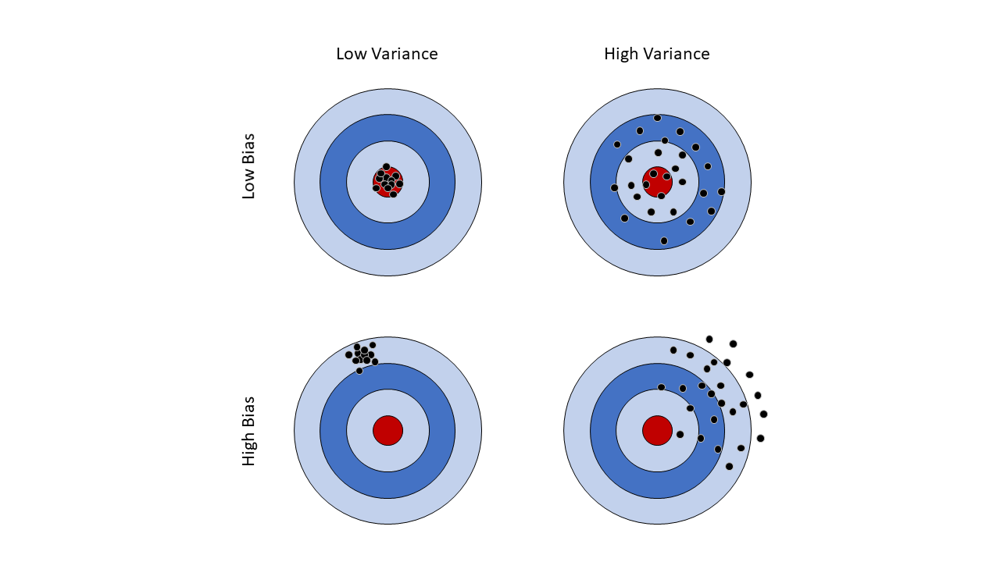

# Sampling Distributions and the <br/> Central Limit Theorem {#ch6}

> "While nothing is more uncertain than a single life, nothing is more certain than the average duration of a thousand lives." - Elizur Wright

> "Everything that can be counted does not necessarily count; everything that counts cannot necessarily be counted." - Albert Einstein


<div class="objective-container">
<div class="objectives"> Learning objectives </div>
1. Learn to differentiate between statistics and parameters      
2. Understand the concept of sampling distributions  
3. Conceptual understanding of Central Limit Theorem and how it applies to sample means
</div>

## Introduction

Suppose policy makers and public health experts in Iowa are concerned with Iowan's fast food intake. To understand this further, the officials want to determine the average monthly spending on fast food for all Iowans. However, it would be very expensive and costly to have all 3.2 million Iowans track and report their total monthly spending on fast food. And certainly many Iowans would not be willing to share personal financial details with public health researchers or government officials. This means it is impossible for the officials to know the true mean amount of money that Iowans spend on fast food each month. The true numeric quantity about the population, such as this, is known as a **population parameter**. While we will never ever know the truth, there are still options. The officials can take a sample of Iowans and have those that consent to share their information report their monthly spending on fast food. Then, they can take the sample mean, which gives them an estimate of the average monthly spending on fast food. The sample mean is an example of a **sample statistic**, which is a numerical quantity about the sample. In other words, statistics are what investigators know, and parameters are what investigators want to know. The statistical framework (pictured below) allows us to make **inference** about population parameters using sample statistics. This means the researchers can use a random sample of Iowans' monthly fast food spending to make generalizations about the average monthly spending for all Iowans. The numerical quantities of interest can be many different things - means, proportions, standard deviations, etc.. In the fast food example, the parameter of interest was a population mean and the sample statistic was the sample mean. In this chapter, we will specifically focusing on estimating means.


```{tikz statFramework, fig.cap = "Statistical Framework", fig.ext = 'png', echo = F}
\usetikzlibrary{decorations.pathreplacing,positioning, arrows, shapes, calc,shapes.multipart}
\tikzstyle{block1} = [rectangle, draw, fill=yellow!20, 
    text width=10em, text centered, rounded corners, minimum height=6em]
\tikzstyle{block2} = [rectangle, draw, fill=yellow!20, 
    text width=5em, text centered, rounded corners, minimum height=3em]
\tikzset{
    %Define standard arrow tip
    >=stealth,
    % Define arrow style
    pil/.style={
           ->,
           thick,
           shorten <=2pt,
           shorten >=2pt,}
}
\tikzstyle{line} = [draw, -latex]
\begin{tikzpicture}[node distance = 3cm, auto]
            % Place nodes
            \node [block1] (pop) {Population \\ (Parameters)};
            \node [block2, below of=pop] (samp) {Sample \\ (Statistics)};
            
            % Draw edges
            \draw[->, >=latex, shorten >=2pt, shorten <=2pt, bend right=45, thick]  (pop.west) to node[auto, swap] {Study Design}(samp.west);
            \draw[->, >=latex, shorten >=2pt, shorten <=2pt, bend right=45, thick] (samp.east) to node[auto, swap] {Inference}(pop.east); 
            
        \end{tikzpicture}
```

The statistical framework outlines the process of making inference using sample statistics to estimate population parameters. Later chapters in this textbook will cover the mathematical details of this process. In trying to make proper inference, we also want to ensure our estimated statistic is measuring the parameter well. To that end, there are two major statistical issues we concern ourselves with: 

* On average, does our estimate tend to be centered around the true answer, or is it *biased*?  
* How much *variability* is there likely to be in our sample? 

The difference between our estimate and our parameter is called **bias**. **Variance** describes the spread of our data, and is sometimes called noise. Sometimes we talk about spread in terms of **precision**, which is the inverse of variance. The more precision we have, the less variance, and vice versa. A good statistic will have little or no bias and would have minimal variability. We can visualize both bias and variability using a dart board analogy.

```{r image-ref-for-in-text2, fig.align ='center', fig.cap='Bias and Variability Illustration', fig.pos='H', message = FALSE, echo=FALSE, fig.height=7, fig.width=9}

```

On the upper left target, the darts are hitting the bullseye with low bias and low variability, shown by the darts having minimal spread and all hitting the bullseye. This is the most desirable outcome when the goal is to hit the bullseye. In the upper right target, we see a lot more variability, as the darts are no longer highly concentrated on the bullseye. However, the dart locations are still centered around the bullseye, and this is why we consider this target to have low bias. This situation is less ideal than having low bias and low variance, but is stil preferable to targets in the bottom row, where we have high bias. In the bottom left target, we have high bias and low variability, evidence by the high concentration of darts that are not hitting the bullseye. The consistency is why we saw there is low variability, but if our goal is to hit the bullseye, we are not going to acheive that goal. Finally, the bottom right target is the worst possible outcome - high bias *and* high variability. We are not hitting the bullseye and the darts are landing erratically. Statisticians work hard to develop inferential procedures that allow us to estimate population parameters with little to no bias and low variability.

<div class="definition-container">
<div class="definition"> Definitions </div>
**Population Parameter: ** <em> The true numeric quantity about a population </em>

**Sample Statistic: ** <em> A numerical quantity about the sample </em>

**Inference: ** <em> The process of making generalizations about the population </em>

**Bias: ** <em> The difference between our estimate and our parameter </em>

**Variability: ** <em> The spread or error in the data </em>

**Precision: ** <em> Inverse of variance, how   </em>
</div>


## Sampling Distributions 


In order to make inference, we must be able to quantify our uncertainty about the population parameter based on our sample data. To quantify our uncertainty, we must first establilsh where it comes from - the sampling process. Any time we take a sample from the population, we will get a different sample mean $\bar{x}$. In other words, $\bar{x}$ is a numeric quantity which assumes a value based on the outcome of a random experiment - the process of drawing a sample at random from the population. This should sound familiar - this is the definition of a random variable! We can use this logic for any statistic of interest. As we've described in the past, random variables have probability distributions. When the random variable is a statistic, this probability distribution is called the sampling distribution. Sampling distributions reflect which values of the statistic are likely and which values are improbable. As we will see later in this chapter, this uncertainty depends on how many individuals we sample and how variable the data we measure is. 


A VISUALIZATION ABOUT SAMPLING DISTRIBUTIONS WOULD BE COOL HERE. SOMETHING THAT SHOWS ALL THE UNITS IN THE POPULATION WITH NUMERIC VALUES ON THEM, THEN TAKE SAMPLE AND CALCULATE MEAN.

I think what would be neat is doing dot plots for a population and have them be all one color, say, red. Once the samples are chosen, they will be presented below with their own distribution in blue. BUT! The ones selected in the random sample would also turn blue, indicating that they were picked. Maybe this is like what that shiny app you showed me was?

As we've seen earlier in this book, we will use upper-case letters to denote random variables, and lower-case letters to denote possible values they can take on. When it comes to the sampling distribution of the mean, $\bar{X}$ is the random variable, which arises from repeated random sampling from the population and then taking a sample mean, and $\bar{x}$ is an observed sample mean we might see. In describing a sampling distribution, we are often interested in the mean and standard deviation - this gives information about typical values the statistic might take on as well as how spread out the distribution is. We refer to the mean of a statistic as the **expected value** and the standard deviation as the **standard error**. For the random variable describing the sample mean, these are denoted as $E(\bar{X})$ and $SE(\bar{X}) = \sqrt{Var(\bar{X})}$, respectively.

Another good way to address the $\bar{X}$ vs $\bar{x}$ is to have something like (&= isn't making them align?)

<div class="latex">
$$
\begin{align*}
\bar{X} &= \{\text{Mean height of} \textit{ Sex and the City } \text{protagonists}\} \\
\bar{x} &= \{\text{Mean height of Carrie and Samantha}\}
\end{align*}
$$
</div>


<div class="definition-container">
<div class="definition"> Definitions </div>
**Expected Value: ** <em> The mean of a statistic in repeated sampling </em>

**Standard Error: ** <em> The standard deviation of a statistic in repeated sampling </em>
</div>


## Central Limit Theorem

Example 

We will use the fast food scenario to motivate our sample, but for let's assume there are only five individuals in the entire population. The monthly spending for those five individuals (rounded to the nearest dollar) is as follows:

```{r, echo = F}
library(knitr)
library(scales)
person <- c('A', 'B', 'C', 'D', 'E')
monthlySpending <- c(8, 22, 22, 36, 50)
avgSpending <- mean(monthlySpending)
dat <- cbind(Person = person, 'Monthly Spending'= monthlySpending)
popSize <- length(person)
sampSize <- 3
nSamples <- choose(popSize, sampSize)
kable(dat)
```


The population mean can be found by taking the average monthly spending of these five individuals, as they are the only people in this population. This means the population mean is `r avgSpending`. Now suppose we are taking samples of three individuals from this population. There are $\binom{5}{3}$ = `r nSamples` ways we can sample three people from this population. Since this is a small population, we can enumerate all possible samples, the values we would obtain for the monthly spending in each sample, and then the sample mean monthly fast food spending for each sample:

```{r, warning=F, echo = F}
allComb <- t(combn(person, 3))
allCombP <- rep(NA, nrow(allComb))
valuesComb <- rep(NA, nrow(allComb))
meanComb <- rep(NA, nrow(allComb))
for (i in 1:nrow(allComb)) {
  allCombP[i] <- paste0('(',paste( allComb[i,], collapse = ', '), ')')
  valuesComb[i] <- paste0('(',paste( dat[dat[,1] %in% allComb[i,],2], collapse = ', '), ')')
  meanComb[i] <- mean(as.numeric(dat[dat[,1] %in% allComb[i,],2]))
}

combDat <- data.frame(Sample = allCombP,
                      Values = valuesComb,
                      'Sample mean'=round(meanComb, 2))
combDat <- combDat[order(combDat[,3]),]

# combine sample/values when sample mean is the same
dupMeans <- combDat[,3][duplicated(combDat[,3])]

combSamples <- NULL
combValues <- NULL

for (i in 1:nrow(combDat)) {
  if (combDat[i,3]%in% dupMeans) {
    # which rows have same mean
    toComb <- which(combDat[,3] == combDat[i,3])
    combSamples <- c(combSamples,
                     paste(combDat[toComb,1], collapse = ', '))
    combValues <- c(combValues,
                     paste(combDat[toComb,2], collapse = ', '))
    
  } else {
    combSamples <- c(combSamples, combDat[i,1])
    combValues <- c(combValues, combDat[i,2])
  }
}

combDat2 <- data.frame(Sample = combSamples,
                      Values = combValues,
                      'Sample mean'=round(meanComb, 2))

toKeep <- which(!duplicated(combDat[,3]))
combDat2 <- combDat2[toKeep,]
kable(combDat2, row.names = F, col.names = c('Sample', 'Values', '$\\bar{x}$'), escape =F)

```

One thing to note is that *none* of the sample means are actually equal to the population mean. This is often the case! Based on this table, we can construct the sampling distribution of $\bar{X}$ for a sample of size three.

::: {.infobox .think data-latex="thinkaboutit"}
Why is our sample mean often not equal to the population mean?
:::


```{r, echo = F}
countMeans <- table(round(meanComb, 2))
col1 <- paste0('P($\\bar{x}$ = ', names(countMeans), ')')
col2 <- prop.table(countMeans)
toPrint <- cbind(col1, col2)
expValue <- sum(as.numeric(names(countMeans))*col2)

kable(toPrint, col.names = c('', 'Probability'), row.names = F, escape = F)
```

With this probability distribution, we can get the expected value of the sampling distribution. Whenever we think about probability, we are thinking about long-run frequencies, so when we think about the expected value, we are thinking about the average sample mean if we were to take repeated samples of size three from this population. The probability distribution indicates that if we took samples of size three from this population over and over again (say 1,000 times), we would end up with `r col2[1]*100`% with a mean of `r names(countMeans)[1]`, `r col2[2]*100`% with a mean of `r names(countMeans)[2]`, `r col2[3]*100`% with a mean of `r names(countMeans)[3]`; and so on. So the expected value (average) we would observed if we kept taking samples over and over would be:

(`r col2[1]` $\times$ `r names(countMeans)[1]`) + (`r col2[2]` $\times$ `r names(countMeans)[2]`)  + (`r col2[3]` $\times$ `r names(countMeans)[3]`)  + (`r col2[4]` $\times$ `r names(countMeans)[4]`) + (`r col2[5]` $\times$ `r names(countMeans)[5]`) =  `r expValue`

But wait! That is the population mean. This illustrates an extremely powerful property of the sample mean - the expected value of the sample mean ($\bar{X}$) is equal to the population parameter ($\mu$)! Because of this, we say that the sample mean is an **unbiased estimator** of the population mean. While we illustrated the property with a small example, this holds regardless of the population or sample size. 

<p> Important Formula!  

For *any* population distribution which can be described by a random variable $X$ with mean $\mu$ and variance $\sigma^2$, the sample distribution of the mean based on sample of size $n$ ($\bar{X}_n$) has the following properties:  

1)  The expected value of the sampling distribution is $\mu$
$$E(\bar{X}_n) = \mu$$
2) The variance of the sampling distribution is
$$Var(\bar{X}_n) = \frac{\sigma^2}{n}$$
</p>

Using these formulas we are able to describe the typical value of the sample mean and how variable the sample mean is in repeated sampling. Notice that the expected value does not depend on the sample size, $n$, but the variance does. This means regardless of the sample size, the sample mean is an unbiased estimator of the population mean. But, as the sample size increases, the variance decreases, and we get a more precise estimate of the population mean. As we've seen in the past, it is more common to talk about the standard deviation than the variance and the standard deviation is the square root of the variance. The quantity $\sqrt{Var(\bar{X}_n)} = \sigma / n$ is primarily called the **standard error** of the mean, and is denoted by $SE(\bar{X}_n)$. We use the term standard error to make it really clear that it is referencing the sampling distribution of the mean, but all standard errors could be refered to as standard deviations. Conversely, not all standard deviations could be referred to as a standard error - the term is only used in describing the distribution of the sample mean.

<p> Example 
Let $X$ denote the resting heart rate of a randomly selected U.S. adult. Assume the distribution of resting heart rates is approximately normally distributed with mean 70 bpm and standard deviation of 5 bpm. Suppose we sample 50 adults. Let $\bar{X}$ denote the mean resting heart rate of these 50 adults.

1) What is the mean of $\bar{X}$? (That is, in repeated sampling, what would be the average value of $\bar{X}$?)  

2) What is the standard error of $\bar{X}$  
    

</p>


<div class="exercise"> Exercises </div>

<!-- frameBorder="0" -->
<iframe src="https://ph-shiny.iowa.uiowa.edu/ceward/textbook/CLT" width = "100%" height = "800"> 
</iframe>


