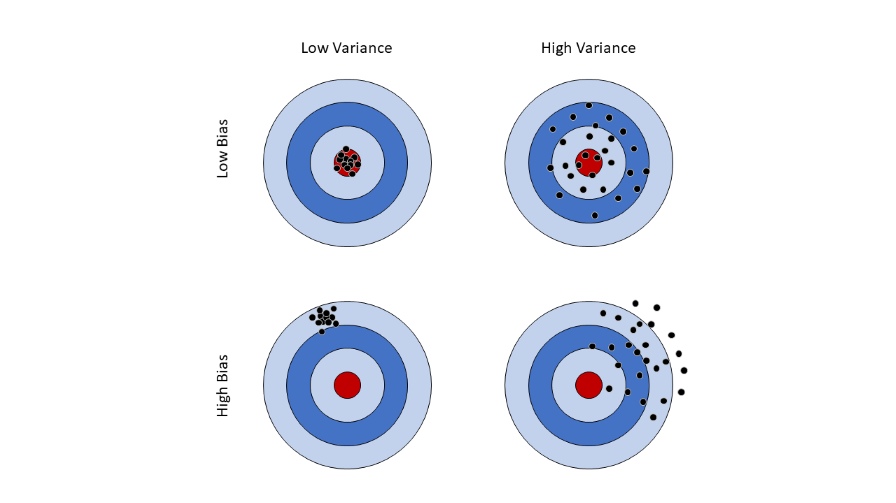

# Sampling Distributions and the <br/> Central Limit Theorem {#ch7}

> "While nothing is more uncertain than a single life, nothing is more certain than the average duration of a thousand lives." - Elizur Wright

> "Everything that can be counted does not necessarily count; everything that counts cannot necessarily be counted." - Albert Einstein


<div class="objective-container">
<div class="objectives"> Learning objectives </div>
1. Learn to differentiate between statistics and parameters      
2. Understand the concept of sampling distributions  
3. Conceptual understanding of Central Limit Theorem and how it applies to sample means
</div>

## Introduction to Sampling

Suppose policy makers and public health experts in Iowa are concerned with Iowans' fast food intake. To understand this further, officials want to determine the average monthly spending on fast food for all Iowans. It would be very expensive, however, to have all 3.2 million Iowans track and report their total monthly fast food expenses. Whatsmore, many Iowans would not be willing to share personal financial details with public health researchers or government officials. These are but a few of the challenges making it practically impossible for officials to ever determine the true average spent by Iowans each month on fast food. 

A true numeric quantity about the population, here assumed to be the mean, is known as a **population parameter**. While we may never know the exact value of a population parameter, we have tools at our disposal to estimate it. For example, officials can determine a *representative sample* of Iowans and have those consenting to share their information report their monthly fast food spending. The average spending of this group is the *sample mean*, which can then be used approximate the population mean. The sample mean is an example of a **sample statistic**, which is a numerical quantity about the sample. In other words, statistics are what investigators know, and parameters are what investigators want to know. 

The statistical framework (pictured below) demonstrates the process of making **inference** about population parameters with the use of sample statistics, as was done in the example above. The numerical quantities of interest can be many different things -- means, proportions, standard deviations, etc.,. While the methods of estimation are similar in each case, the present chapter will focus specifically on estimations of the mean. (maybe mention here that this is general discussion with mathematical derivations saved for a later chapter)


```{tikz statFramework2, fig.cap = "Statistical Framework", fig.ext = 'png', echo = F, fig.align= 'center'}

\usetikzlibrary{decorations.pathreplacing,positioning, arrows, shapes, calc,shapes.multipart}
\tikzstyle{block1} = [rectangle, draw, fill=yellow!20,
    text width=10em, text centered, rounded corners, minimum height=6em]
\tikzstyle{block2} = [rectangle, draw, fill=yellow!20,
    text width=5em, text centered, rounded corners, minimum height=3em]
\tikzset{
    %Define standard arrow tip
    >=stealth,
    % Define arrow style
    pil/.style={
           ->,
           thick,
           shorten <=2pt,
           shorten >=2pt,}
}
\tikzstyle{line} = [draw, -latex]
\begin{tikzpicture}[node distance = 3cm, auto]
            % Place nodes
            \node [block1] (pop) {Population \\ (Parameters)};
            \node [block2, below of=pop] (samp) {Sample \\ (Statistics)};

            % Draw edges
            \draw[->, >=latex, shorten >=2pt, shorten <=2pt, bend right=45, thick]  (pop.west) to node[auto, swap] {Study Design}(samp.west);
            \draw[->, >=latex, shorten >=2pt, shorten <=2pt, bend right=45, thick] (samp.east) to node[auto, swap] {Inference}(pop.east);

        \end{tikzpicture}
```


The statistical framework outlines the general process of making inference using sample statistics to estimate population parameters. In trying to make proper inference, we want to ensure our that our calculated statistic is a valid estimate of the population parameter of interest. To that end, there are two major statistical issues we concern ourselves with: 

* On average, does our estimate tend to be centered around the true answer, or is it *biased*?  
* How much *variability* is there likely to be in our sample? 

The difference between our estimate and our parameter is called **bias**. **Variance** (or "noise") is a description of the spread of our data. Sometimes we talk about spread in terms of **precision**, which is the reciprocal of variance. The more precision we have, the less variance, and vice-versa. A good statistic will have little or no bias and would have minimal variability. We can visualize both bias and variability using a dart board analogy:

```{r image-ref-for-in-text2, fig.align ='center', fig.cap='Bias and Variability Illustration', fig.pos='H', message = FALSE, echo=FALSE, fig.height=7, fig.width=9}

```

In terms of priority, having a low bias is generally more desirable than low variance, and this is represented in the top row above. Having low bias indicates that our sample statistic is correctly estimating the population parameter of interest, even if our statistic is considered "noisy". Variance, illustrated in the columns, gives an idea of how "consistent" our estimate is. One way to think of it is to consider the throwing of a dart to the collection of a sample; comparing the top right and bottom left corners, we might say it is better throw generally close to the target than to consistently miss it entirely. Statisticians work hard to develop sampling and inferential procedures that allow us to estimate population parameters with low variability and little to no bias.

---

<div class="definition-container">
<div class="definition"> &nbsp; </div>
<div class="text">
**Population Parameter: ** <em> The true numeric quantity describing a population (i.e., the population mean) </em>

**Sample Statistic: ** <em> A numerical quantity about the sample, often used to estimate a population parameter </em>

**Inference: ** <em> The process of making generalizations about the population based on sampling statistics </em>

**Bias: ** <em> The systematic difference between our estimate and the true parameter </em>

**Variability: ** <em> The spread or noise in the data </em>

**Precision: ** <em> Inverse of variance, how "narrow" the data is   </em>

</div>
</div>

## Sampling Distributions 

In order to make inference, we must be able to quantify our uncertainty about the population parameter based on our sample data. To illustrate this uncertainty, consider again our example above in estimating the average expenditures of Iowans on fast food, and suppose that researchers decide to sample 500 individuals from the population and calculate the sample mean, $\overline{x}$. Now suppose that those same researchers go out and collect a *second* sample of 500 individuals from the population and calculate the sample mean again, which me might call $\overline{x}_2$. Should we expect $\overline{x}$ and $\overline{x}_2$ to be exactly the same? What if they did this again and calculated $\overline{x}_3$? Or $\overline{x}_4$?

As we might expect, it is very unlikely that any of these will be exactly equal to any of the others, though they might be close. But if none of these sample means are equal to each other, how accurate might we expect any of them to be with regards to estimating our population parameter? Herein lies the question of quantifying our uncertainty. Fortunately, statisticians have created powerful methods for being able to do so accurately, even when only a single sample statistic has been obtained.

We might first begin by recognizing that the process of sampling from a population is itself a *random experiment*, with the sample mean $\overline{x}$ being a numeric quantity which assumes a value based on the outcome of that experiment. This should sound familiar -- this is precisely the definition of a random variable! Just as with other random variables, sample statistics themselves also follow a probability distribution. When the random variable itself is a statistic, we call the probability distribution a **sampling distribution**. Sampling distributions reflect which values of the statistic are likely if we were to repeat the sampling process (that is, likely values for $\overline{x}_2$, $\overline{x}_3$, etc.,), and which values are improbable. We might then expect that the value of the true population parameter will fall somewhere within the range of likely values. [[As we will see later in this chapter, this uncertainty depends on the number of individuals sampled and the variability of the data we measure.]]


<div class="exercise-container">
<div class="exercise"> &nbsp; </div>
<div class="text">

The applet below is designed to help you get familiar with the concept of random sampling. The plot on the left side gives a population distribution consisting of 25 people, where each subject in the population is represented by one box. The x-axis represents the value of the outcome variable for each individual, with stacked boxes indicating that multiple people have the same value. For example, we have one subject in the population with a value of zero, three subjects with values of one, and so on. 

The plot on the right displays values for the subjects collected in our random sample, with the same subjects being highlighted in green on the left. We can take samples from our population of various sizes by changing the value of the slider at the top and clicking on the "Sample" button.
</div>
</div>
<!-- frameBorder="0" -->
<iframe src="https://ph-ivshiny.iowa.uiowa.edu/ceward/textbook/shinyApps/sampling/" width = "100%" height = "800"> 
</iframe>

<div class="exercise-container">

<ol>
  <li>Set the sample size to 2 and click the "Sample" button five times. Fill out the following table with the sample means observed in your five samples.
  <table style="width:50%">
  <tr>
    <th style="text-align:center">Sample Number</th>
    <th>Sample mean</th>
  </tr>
  <tr>
    <td style="text-align:center">1</td>
    <td></td>
  </tr>
  <tr>
    <td style="text-align:center">2</td>
    <td></td>
  </tr>
  <tr>
    <td style="text-align:center">3</td>
    <td></td>
  </tr>
  <tr>
    <td style="text-align:center">4</td>
    <td></td>
  </tr>
  <tr>
    <td style="text-align:center">5</td>
    <td></td>
  </tr>
</table>
  
  <ol style="list-style-type: lower-alpha;">
  <li> Did you get the same sample mean for any of your five samples?</li>
  <li> Was the sample mean ever equal to the population mean in any of your five samples? If not, how close were your sample means to the true population mean?</li>
  </ol>
  </li>
  <li> Now set the sample size to 15 and click the "Sample" button five times. Fill out the following table with the sample means observed in your five samples.
  <table style="width:50%">
  <tr>
    <th style="text-align:center">Sample Number</th>
    <th>Sample mean</th>
  </tr>
  <tr>
    <td style="text-align:center">1</td>
    <td></td>
  </tr>
  <tr>
    <td style="text-align:center">2</td>
    <td></td>
  </tr>
  <tr>
    <td style="text-align:center">3</td>
    <td></td>
  </tr>
  <tr>
    <td style="text-align:center">4</td>
    <td></td>
  </tr>
  <tr>
    <td style="text-align:center">5</td>
    <td></td>
  </tr>
</table>

  <ol style="list-style-type: lower-alpha;">
  <li> Did any of your five simulations give you a sample mean equal to the population mean?</li>
  <li> How close were your sample means to the true population mean?</li>
  </ol>
  </li>
  <li> Compare your results from problems 1 and 2. 
  <ol style="list-style-type: lower-alpha;">
    <li> In either case were you able to obtain a sample mean equal to the population mean?</li>
    <li> Which one had sample means with more variability? What does this indicate about the relationship between the sample size and the distribution of sample means in the context of repeated sampling?</li>
  </ol>
  </li>
</ol>

</div>

Following the conventions used previously, we will use upper-case letters to denote random variables and lower-case letters to denote values that have been observed (that is, they are no longer random). Regarding the sampling distribution of the mean, $\overline{X}$ represents the random variable which arises from the repeated random sampling from the population, while $\overline{x}$ represents an *observed* sample mean from an already collected sample.

In describing the sampling distribution, we are often interested in the mean and the standard deviation which, together, describe the size of the interval of probable values for our population parameter. When describing statistics with a sampling distribution, we refer to the sample mean as the **expected value** of our statistic, while the standard deviation is referred to as the **standard error**. For the random variable describing the sample mean, these are denoted as $E(\overline{X})$ and $SE(\overline{X}) = \sqrt{Var(\overline{X})}$, respectively.


Let's return to the fast food scenario to motivate our development, but for now let's assume there are only five individuals in the entire population. The monthly spending for those five individuals (rounded to the nearest dollar) is as follows:

```{r, echo = F}
library(knitr)
library(kableExtra)
library(scales)
person <- c('A', 'B', 'C', 'D', 'E')
monthlySpending <- c(8, 22, 22, 36, 50)
avgSpending <- mean(monthlySpending)
dat <- cbind(Person = person, 'Monthly Spending'= monthlySpending)
popSize <- length(person)
sampSize <- 3
nSamples <- choose(popSize, sampSize)
kable(dat) |> kable_styling(full_width=FALSE)
```


The population mean can be found by taking the average monthly spending of these five individuals, as they are the only people in this population. This means the population mean is `r avgSpending`. Now suppose we are taking samples of three individuals from this population. There are $\binom{5}{3}$ = `r nSamples` ways we can sample three people from this population. Since this is a small population, we can enumerate all possible samples, the values we would obtain for the monthly spending in each sample, and then the sample mean monthly fast food spending for each sample:

```{r, warning=F, echo = F}
allComb <- t(combn(person, 3))
allCombP <- rep(NA, nrow(allComb))
valuesComb <- rep(NA, nrow(allComb))
meanComb <- rep(NA, nrow(allComb))
for (i in 1:nrow(allComb)) {
  allCombP[i] <- paste0('(',paste( allComb[i,], collapse = ', '), ')')
  valuesComb[i] <- paste0('(',paste( dat[dat[,1] %in% allComb[i,],2], collapse = ', '), ')')
  meanComb[i] <- mean(as.numeric(dat[dat[,1] %in% allComb[i,],2]))
}

combDat <- data.frame(Sample = allCombP,
                      Values = valuesComb,
                      'Sample mean'=round(meanComb, 2))
combDat <- combDat[order(combDat[,3]),]

# combine sample/values when sample mean is the same
dupMeans <- combDat[,3][duplicated(combDat[,3])]

combSamples <- NULL
combValues <- NULL

for (i in 1:nrow(combDat)) {
  if (combDat[i,3]%in% dupMeans) {
    # which rows have same mean
    toComb <- which(combDat[,3] == combDat[i,3])
    combSamples <- c(combSamples,
                     paste(combDat[toComb,1], collapse = ', '))
    combValues <- c(combValues,
                     paste(combDat[toComb,2], collapse = ', '))
    
  } else {
    combSamples <- c(combSamples, combDat[i,1])
    combValues <- c(combValues, combDat[i,2])
  }
}

combDat2 <- data.frame(Sample = combSamples,
                      Values = combValues,
                      'Sample mean'=round(meanComb, 2))

toKeep <- which(!duplicated(combDat[,3]))
combDat2 <- combDat2[toKeep,]
kable(combDat2, row.names = F, col.names = c('Sample', 'Values', '$\\overline{x}$'), escape =F) |> kable_styling(full_width=FALSE)

```

One thing to note is that *none* of the sample means are actually equal to the population mean. This is often the case! Based on this table, we can construct the sampling distribution of $\overline{X}$ for a sample of size three.

::: {.infobox .think data-latex="thinkaboutit"}
Why is our sample mean often not equal to the population mean?
:::


```{r, echo = F}
countMeans <- table(round(meanComb, 2))
col1 <- paste0('P($\\overline{x}$ = ', names(countMeans), ')')
col2 <- prop.table(countMeans)
toPrint <- cbind(col1, col2)
expValue <- sum(as.numeric(names(countMeans))*col2)

kable(toPrint, col.names = c('', 'Probability'), row.names = F, escape = F) |> kable_styling(full_width=FALSE)
```

With this probability distribution, we can get the expected value of the sampling distribution. Whenever we think about probability, we are thinking about long-run frequencies, so when we think about the expected value, we are thinking about the average sample mean if we were to take repeated samples of size three from this population. The probability distribution indicates that if we took samples of size three from this population over and over again (say 1,000 times), we would end up with `r col2[1]*100`% with a mean of `r names(countMeans)[1]`, `r col2[2]*100`% with a mean of `r names(countMeans)[2]`, `r col2[3]*100`% with a mean of `r names(countMeans)[3]`; and so on. So the expected value (average) we would observed if we kept taking samples over and over would be:

(`r col2[1]` $\times$ `r names(countMeans)[1]`) + (`r col2[2]` $\times$ `r names(countMeans)[2]`)  + (`r col2[3]` $\times$ `r names(countMeans)[3]`)  + (`r col2[4]` $\times$ `r names(countMeans)[4]`) + (`r col2[5]` $\times$ `r names(countMeans)[5]`) =  `r expValue`

But wait! That *is* the population mean. This illustrates an extremely powerful property of the sample mean - the expected value of the sample mean $\overline{X}$ is equal to the population parameter $\mu$! Because of this, we say that the sample mean is an **unbiased estimator** of the population mean. While we illustrated the property with a small example, this holds regardless of the population or sample size. 

---

<div class="definition-container">
<div class="definition"> &nbsp; </div>
<div class="text">
**Sampling Distribution: ** <em> A probability distribution associated with a sample statistic </em>

**Expected Value: ** <em> The mean value of a statistic in repeated sampling </em>

**Standard Error: ** <em> The standard deviation of a statistic (including the mean) in repeated sampling </em>

**Unbiased Estimator: ** <em> The statistic with an expected value equal to the true population parameter</em>
</div>
</div>


## Central Limit Theorem

In the last section, we used a toy example to conceptualize repeated sampling and the property of the sample mean being an unbiased estimator. Now we will formalize these properties. For *any* population distribution which can be described by a random variable $X$ with mean $\mu$ and variance $\sigma^2$, the sample distribution of the mean based on sample of size $n$, denoted $\overline{X}_n$, has the following properties:  

1)  The expected value of the sampling distribution is $\mu$
$$E(\overline{X}_n) = \mu$$
2) The variance of the sampling distribution is
$$Var(\overline{X}_n) = \frac{\sigma^2}{n}$$

Together, these expressions are used to describe the typical value of the sample mean as well as the expected amount of variability in the sample mean under repeated sampling. From this, there are two further observations that are worth noting:

1) The expected value of the sample mean is always equal to $\mu$, regardless of the size of the sample: this property makes the sample mean an *unbiased* estimator of the population mean.

2) Whereas the expected value of the sample mean does not depend on $n$, the variance of the sampling distribution does. Indeed, this should match our intuition; as the size of our sample increases, the variability of $\overline{X}_n$ decreases, giving us a more precise estimate of the population mean.

As we've seen already, it is more common to discuss the standard deviation of a 
statistic than the variance. In the context of sampling distributions, this quantity 
is called the *standard error* (to emphasize that we are discussing a sampling 
distribution) and is denoted

$$SE(\overline{X}_n) = \sqrt{Var(\overline{X}_n)} = \sigma / \sqrt{n}$$

Note that while all standard errors could be referred to as standard deviations, 
the converse does not hold -- standard deviations not associated with a sampling
distribution are never referred to as standard errors. 

<!-- Using these formulas we are able to describe the typical value of the sample mean and how variable the sample mean is in repeated sampling. Notice that the expected value does not depend on the sample size, $n$, but the variance does. This means regardless of the sample size, the sample mean is an unbiased estimator of the population mean. But, as the sample size increases, the variance decreases, and we get a more precise estimate of the population mean. As we've seen in the past, it is more common to talk about the standard deviation than the variance and the standard deviation is the square root of the variance. The quantity $\sqrt{Var(\overline{X}_n)} = \sigma / \sqrt{n}$ is primarily called the **standard error** of the mean, and is denoted by $SE(\overline{X}_n)$. We use the term standard error to make it really clear that it is referencing the sampling distribution of the mean, but all standard errors could be referred to as standard deviations. Conversely, not all standard deviations could be referred to as a standard error - the term is only used in describing the distribution of the sample mean. -->

Until now, we have discussed the mean and standard error of a random statistic
without having described the sampling *distribution* itself. Why might having
the distribution of a statistic be useful? Recall from the previous chapter that
we defined a distribution as a method of associating an event or outcome with 
its corresponding probability. As we shall see, the sample mean, along with 
its standard error, will help us in constructing a range of "likely" values 
that may contain the true parameter. With the use of a sampling distribution, 
we will now be able to assign a probability to the range of these likely values.

As it turns out, the process of randomly collecting a sample from a population 
and computing its sample means has a truly amazing property -- the sampling
distribution will always be normally distributed. This brings us to what is 
largely considered the "fundamental theorem of statistics". 


**Central Limit Theorem**

What the Central Limit Theorem (CLT) states is this: so long as the size of our sample is "large enough", the sampling distribution of $\overline{X}$ will be approximately normal, regardless of the characteristics of the underlying distribution. That is, we have

$$\overline{X}_n \sim N(\mu, \sigma^2/n).$$

While the term "large enough" will inevitably depend on the context of the problem at hand, a typical rule of thumb puts this value at $n \geq 30$. Because the variance of $\overline{X}$ is inversely related to the sample size, as the $n$ increases, the variance decreases and the distribution becomes more concentrated around its mean value. This is one of the most important, remarkable, and powerful results in all of statistics. In the real world, we rarely know the underlying population distribution of our data, yet the CLT assures us that this is not an issue. In the next chapter, we will investigate how the consequences of the CLT create an immensely powerful tool in performing statistical inference. 


<div class="exercise-container">
<div class="exercise"> &nbsp; </div>
<div class="text">
The applet below is designed to help your conceptual understanding of the CLT. You can change the underlying population distribution, the size of the samples taken ($n$), and the number of experiments performed. Each experiment consists of taking a sample of the specified size from the population and calculating the sample mean. The top left panel (blue) shows the underlying population distribution. The top right panel (red) shows the data from the most recent sample, with the sample mean from that specific sample indicated by the dashed black line. The bottom panel (gold) shows us the distribution of sample means from all the experiments, with the observed mean of the sample means indicated by the dashed black line and the true underlying population mean indicated by the solid blue line. Once you select the parameters to the values you want, click "Run Simulation" to tabulate the results.
</div>
</div>


<!-- frameBorder="0" -->
<iframe src="https://ph-ivshiny.iowa.uiowa.edu/ceward/textbook/shinyApps/CLT/" width = "100%" height = "800"> 
</iframe>


<div class="exercise-container">
<ol>
  <li>Set the population distribution to Normal, the sample size to 30 and perform 100 experiments to collect 100 sample means. 
  <ol style="list-style-type: lower-alpha;">
  <li>Describe the histogram of the the data from the last experiment. Comment on the modality and skew. </li>
  <li>Describe the histogram of the distribution of sample means from all experiments. </li>
  <li>What is the range of values observed for the distribution of sample means? How does this compare the the range of values observed in the data from the last experiment? </li>
  </ol>
  </li>
  <li>Now adjust the sample size to 100. Perform 100 experiments.
  <ol style="list-style-type: lower-alpha;" >
  <li>What is the range of values observed for the distribution of sample means? How does this compare to the range observed when the sample size was 30? </li>
  <li>What about the range of values observed in the data from the last experiment -- did this change much when the sample size was increased? </li>
  <li>Play around with various sample sizes. How does changing the sample size effect the spread of the distribution of sample means? </li>
  </ol>
  </li>
  <li>Return to a sample size of 30, but change the population distribution to be right skewed. Perform 1,000 experiments.
  <ol style="list-style-type: lower-alpha;" >
  <li>Describe the histogram of the the data from the last experiment. Comment on the modality and skew. </li>
  <li>Describe the histogram of the distribution of sample means from all experiments. Does it resemble the population distribution? </li>
  <li>Re-run the simulation using a sample size of 10. How does this effect the distribution of the sample means? How does this compare to what you observed when taking samples of size 10 with a normal population distribution? </li>
  </ol>
  </li>
  <li>Change the population distribution to be left skewed, set the sample size to 80, and perform 1,000 experiments.
  <ol style="list-style-type: lower-alpha; ">
  <li>Describe the histogram of the the data from the last experiment. Comment on the modality and skew. </li>
  <li>Describe the histogram of the distribution of sample means from all experiments. Does it resemble the population distribution? </li>
  <li>Run the simulation with these parameters a few times and pay attention to how the mean of the distribution of sample means compares to the population mean. Is the population mean similar or different from the mean of the sample means? What property does this illustrate? </li>
  </ol>
  </li>
  <li>Change the parameters of the simulations as needed to answer the following true/false questions. Explain your answers. 
  <ol style="list-style-type: lower-alpha; ">
  <li>CLT tells us that the distribution of data from any experiment will be normally distributed.</li>
  <li>With a larger sample size, the data from the last experiment will resemble the population distribution. </li>
  <li>Performing 10 experiments is enough to see the effect of CLT. </li>
  <li>Regardless of the underlying population distribution and the sample size, the distribution of the sample means will be normally distributed. </li>
  <li>Increasing the sample size causes the data from a single experiment to look more and more normally distributed. </li>
  </ol>
  </li>
</ol>
</div>


---

<div class="definition-container">
<div class="definition"> &nbsp; </div>
<div class="text">
**Central Limit Theorem: ** <em> A mathematical theorem that provides us with the sampling
distribution of the mean </em>

</div>
</div>


